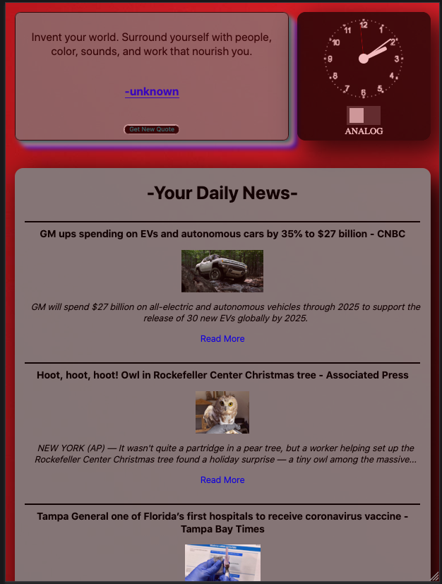
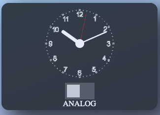
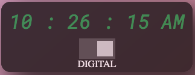

# The GLORP Dashboard



Our product was created to give users a simple yet colorful experience to set as their homepage. It was build with a mobile first approach to better meet the needs of cell phone users over desktop users.

But that's not to say that users should not user this as a desktop app, far from it. For users with large screen sizes, we've included an API endpoint that displays a different background image from the Lorem Picsum database to accommodate the needs of desktop users.

Users are able to quickly start their device and checkout quick headlines and read an inspiring quote to start their day. Or check at lunch. Or when they feel they can get to their phone.

The clocks are simple but aesthetically tasteful and are built from a mix of Javascript and CSS.

## The Clocks

We wanted our users to be able to see a more stylized time piece when they visited our site. To accommodate them, we've added two different clocks with a toggle to switch between. The first is the analog time piece:

**ANALOG**



**DIGITAL**



These are running on pure Javascript using the Date object and its methods to supply the raw time data that is converted to seconds, minutes and hours respectively.

```javascript
export const runClock = () => {
    let now = new Date();
    let seconds = now.getSeconds();
    let minutes = now.getMinutes();
    let hours = now.getHours();
    let am_pm = "AM";
    ...

```

Once that data is retrieved, then a small calculation is made to determine the degree of the hands at a place in time on the application.

You can refer to the code here:

[Clock_Code](modules/clock-module.js)

And you can view the applied styles here:

[Clock_Style](styles/clockstyles.css)

Each clock was built from the inspiration from the following two links:
[Analog](https://www.youtube.com/watch?v=Ki0XXrlKlHY)
[Digital](https://www.codesdope.com/blog/article/how-to-create-a-digital-clock-using-javascript/)

## Gradient Background on Mobile

Our design idea centered around creating a mobile first approach. While we wanted to have an actual image on the Glorp Dashboard, we felt that users on mobile might have data issues that need to be considered; we don't want people to have to use their data on an image.

To keep the user experience high, we created a simple random gradient generator to ensure the look of our product remained high. It's quite small and sets the direction of the linear gradient as well as the RGB code randomly each time it is called. The opacity is kept at a constant 70%, as we found that to be the best quality.

```javascript
export const generateAnImage = () => {
	const direction = Math.floor(Math.random() * 361);
	const red1 = Math.floor(Math.random() * 256);
	const green1 = Math.floor(Math.random() * 256);
	const blue1 = Math.floor(Math.random() * 256);
	const red2 = Math.floor(Math.random() * 256);
	const green2 = Math.floor(Math.random() * 256);
	const blue2 = Math.floor(Math.random() * 256);

	main.style.background = `linear-gradient(${direction}deg, rgba(${red1},${green1},${blue1}, .7), rgba(${red2},${green2},${blue2},.7))`;
};
```

## Random Background Image

For users on tablets and larger, we decided to randomly generate an image form the Lorem Picsum API. You can visit their site here:

[Lorem_Picsum](https://picsum.photos/)

This simple API allows us to make a fetch call without having to rely on an API key. Plus they have an endpoint that can pick an image based on an ID value when the call is made, which is how the function is being used.

```javascript
export const backgroundImage = () => {
	let randomGeneratedImageID = Math.floor(Math.random() * 201);
	fetch(`${URLs.backgroundImage}${randomGeneratedImageID}/info`, requestOptions)
		.then((response) => response.json())
		.then(
			(result) =>
				(mainTag.style.backgroundImage = `url(${result.download_url})`)
		)
		.catch((error) => console.log("Error", error));
};
```

Each time the function is run it randomly generates a number from 0-200 which is used in the fetch call to return that image to the app. The scrip that runs the main app function initially checks for a window size before allowing that function to be called that retrieves the end point data and displays the image.

```javascript
const windowsScreenSize = window.matchMedia("(min-width:766px)");

if (windowsScreenSize.matches) {
	backgroundImage();
} else {
	generateAnImage();
}

windowsScreenSize.addListener(handleScreenSize);
```

We wanted our users to not have to use their data if they are on the mobile, so the first big of logic checks the window screen size before either calling the random image fetch or the background gradient function. The listener function similarly calls the gradient function when the screen is resized to a smaller dimension.

## Headline News

- Brings the top news headlines in the US onto the dashboard.
- Will change throughout the day as new news breaks.
- Displays a brief summary of the article and a link to the full article.
- Using fetch, we are able to obtain key pieces of data and organize them to keep the user up to date on the day's top stories.

```javascript
export const newsUpdate = () => {
	fetch(URLs.news, requestOptions)
		.then((response) => response.json())
		.then((result) => placeNewsOnPage(result))
		.catch((error) => console.log("error", error));
};

const placeNewsOnPage = (res) => {
	res.articles.forEach(makeArticle);
};
```

## Quote Section

In this section we provide the user with the ability to access quotes at random. When the Button function is called it refreshes a new quote with the Author. We also added a function that provides a delay once the quote button is clicked. In some instances the author of a quote is "unknown" so we added a function to render unknown in place of the author.

```Javascript
if (author != false) {
		authorEL.append(author);
		div.append(authorEL);
	} else {
		authorEL.append("-unknown");
		div.append(authorEL);
	}
```
